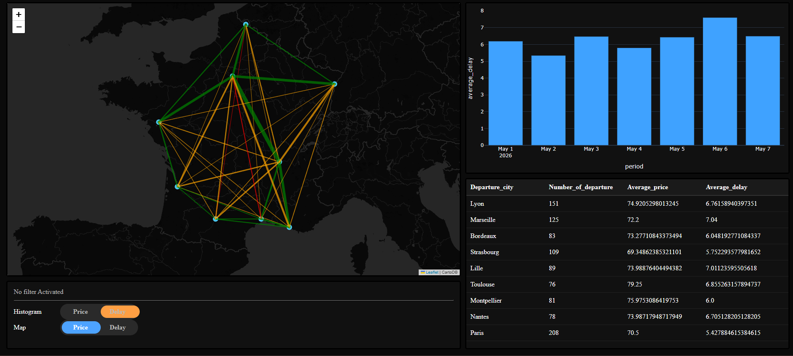
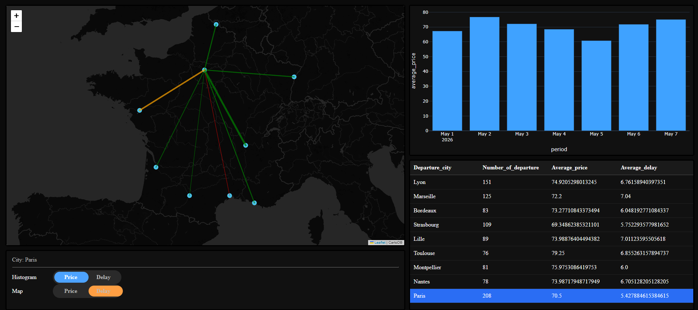
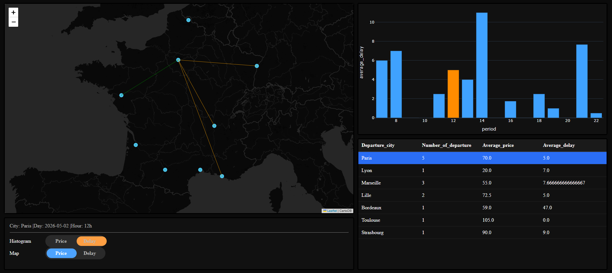

# 🚆 Transport Dashboard

This project is an interactive dashboard built to visualize and analyze transportation trips between cities.

The dataset is synthetically generated and contains trips between 10 predefined cities. Each trip includes information such as the departure city, arrival city, departure time, delay, and ticket price.

The dashboard features an interactive map displaying connections between cities, as well as a table and a histogram for data exploration. Users can filter the data by city and time, and all visualizations are updated dynamically according to the selected filters.

## 📸 Preview

### Global view



### Filter by city

Select a departure city to update the map, statistics and displayed data.



### Filter by city, day and hour

The dashboard supports progressive filtering by city, day and hour.




## ✨ Features
## ✨ Features

- Interactive transport dashboard
- Synthetic dataset generation
- Map visualization of trips between cities
- Histogram and table analytics
- Filtering by city, day and hour
- Dynamic updates across all visualizations
- Delay and price monitoring


## 🛠️ Technologies

### Frontend & Visualization
- Dash
- Plotly
- Folium
- HTML/CSS

### Backend & Data
- Python
- PostgreSQL
- SQLAlchemy
- Argparse
## ⚙️ Installation

Start the PostgreSQL database:

```bash
docker compose up -d
```

## ▶️ Usage

Create database tables:

```bash
python -m backend.main --create
```

Reset database tables:

```bash
python -m backend.main --reset
```

Generate 1000 synthetic trips:

```bash
python -m backend.main --seed
```

Generate a custom number of trips:

```bash
python -m backend.main --seed 5000
```

Reset the database and generate 1000 trips (default behavior):

```bash
python -m backend.main
```

Launch the dashboard:

```bash
python -m dashboard.app
```

> Running `python -m backend.main` without arguments will automatically recreate the database tables and generate 1000 synthetic trips.


## ⚠️ Limitations

The generated data is synthetic and created for visualization purposes.

Prices and delays are simulated and do not represent real transport data.

The route color system currently uses simplified thresholds.


## 🚀 Possible Improvements

* Generate trips across a larger time range.
* Increase the number of available cities.
* Allow users to customize the generated date range.
* Add advanced filtering and search options.
* Implement more realistic pricing models based on distance, location, and travel time.
* Generate delays using more realistic traffic and scheduling patterns.
* Improve route color scaling by using relative metrics instead of fixed thresholds.
* Add a form to manually create and analyze custom trips.
* Provide more control over synthetic data generation parameters.
* Add additional analytics and performance indicators.
* Improve dashboard usability and visual presentation.


## 🎯 Goal

This project was created to practice:

* synthetic data generation
* database design with PostgreSQL
* ORM usage with SQLAlchemy
* interactive dashboard development with Dash
* data visualization with Plotly and Folium
* filtering and data exploration
* connecting multiple visual components
* backend and frontend integration
